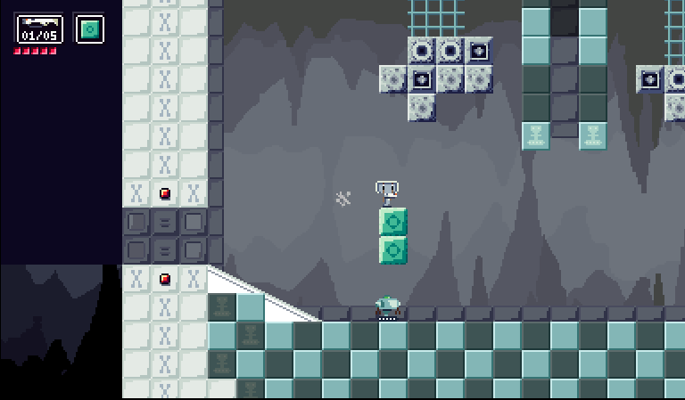

# The Matter Gun
## Playable game concept demo
### ***\*IT MATTERS!\****

Will be playable at skalestudios.com. Planned web embedded. Downloads for Windows, Mac, and Linux will be available.

Inspired by games like Metroid, Cave Story, Portal. World tensions running high, as there is an on going arms race in response to rumors of magic and other exotic threats from a foreign entity. Meanwhile, deep underground, new advanced technologies are being developped. Including combat robots and a new nmysterious technology powering THE MATTER GUN.

## Screenshots
### ***\*wow much color!\****

## Notes
### ***\*hey listen!\****

Project built with Unity

